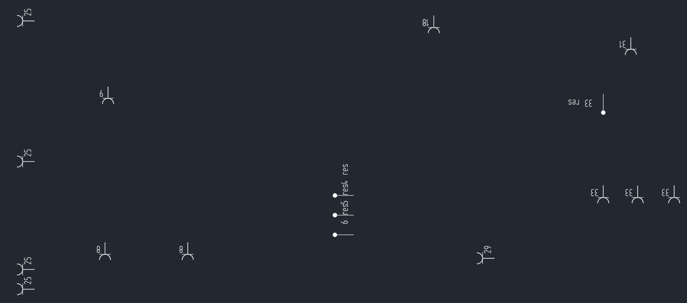
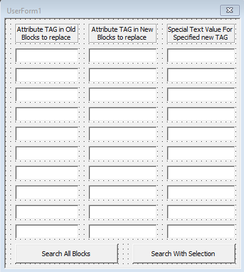

# About Project

This project has been created specifically for my needs at work. The company in question Fabricon is a technical drawing office. Although its general working area is underfloor heating systems, it provides technical drawing support for many 2D and 3D projects and provides technical drawing consultancy services to engineering companies.

## The Need In Question

Some technical drawing jobs need software, not a human brain. At the point where AutoCAD cannot meet the needs, VBA rushes to our help.

Below image is the electrical project of a factory.

In this image, it seems that different symbols are expressed with different characteristics. The problem is that due to the updating of the specifications, the old symbols are no longer valid and need to be replaced with new ones. Doing this by hand can take days for a large factory. Our solution will be to write an algorithm that will transfer the old properties that will replace the old symbols with new symbols, as well as transfer them to new symbols.

The form information received from the user with the form seen above is stored in memory, and the exchange process, which can take days, is changed with new symbols, as with those properties, takes place in seconds.

